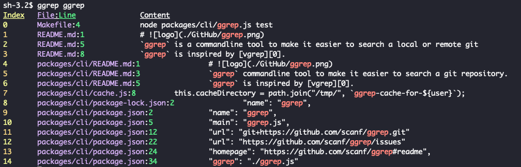

#  

`ggrep` is a commandline tool to make it easier to search a local or remote git
repository.

`ggrep` is inspired by [vgrep][0].

## Installation

        npm install ggrep -g 

## Usage

        # Inside a git directory
        ggrep coolFunction
        # Show match
        ggrep show 0

## Setting up development environment

        npm run bootstrap

## LICENSE

The project uses a MIT licenses for all files unless otherwise specified.

The project logo was created using the awesome [logo-maker](https://logo-maker.egoist.sh/) from [egoist/logo-maker](https://github.com/egoist/logo-maker).

[0]: https://github.com/vrothberg/vgrep

## Screenshot

